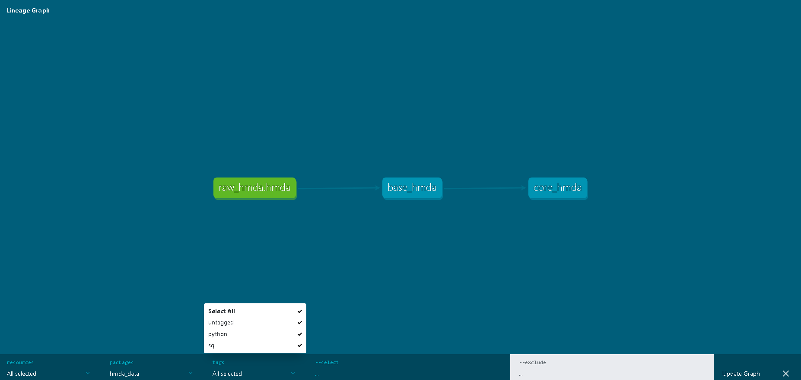

# Testing dbt Python project

This sample test project is used to test out dbt python (dbt-py) models.
Currently running this test on Snowflake data warehouse, uses some Snowpark Python. The data is from Home Mortgage Disclosure Act.

## Lineage Graph

### Using the starter project

Try running the following commands:
- dbt run select tags:python # This will run dbt-py models
- dbt run select tags:sql # This will run sql models
- dbt test

### Resources:
- Learn more about dbt [in the docs](https://docs.getdbt.com/docs/introduction)
- Check out [Discourse](https://discourse.getdbt.com/) for commonly asked questions and answers
- Join the [chat](https://community.getdbt.com/) on Slack for live discussions and support
- Find [dbt events](https://events.getdbt.com) near you
- Check out [the blog](https://blog.getdbt.com/) for the latest news on dbt's development and best practices

